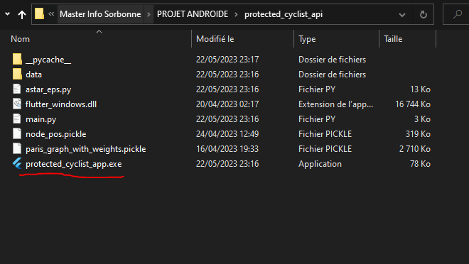
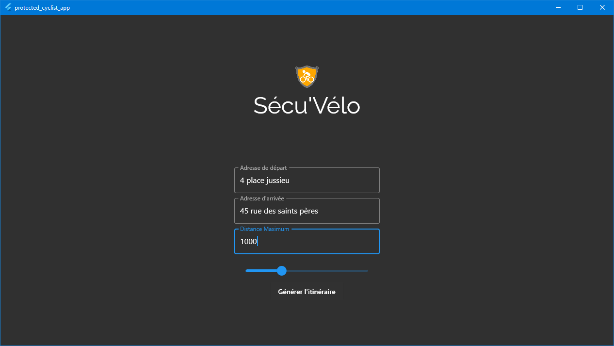
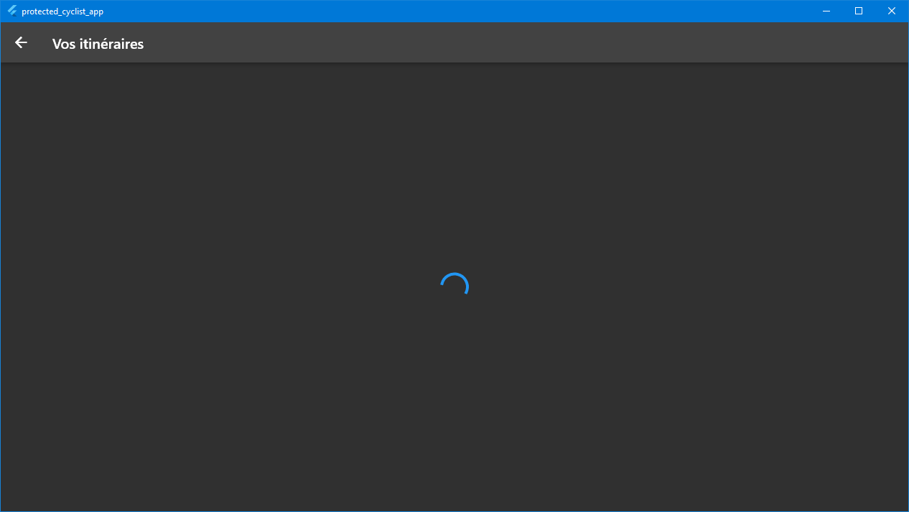
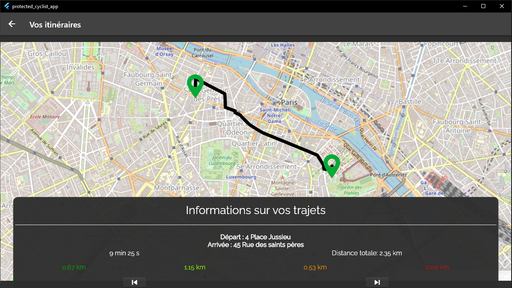

*Note: Pour le moment, seule la version Windows de l'application est disponible. Mais il est possible de build via Flutter un exécutable pour chaque plateforme avec les bons SDKs installés sur la machine. (Aucun changement de code requis)*

## Installation de Python et des pré-requis

Vous devez d'abord installer **Python 3.8.16** et les bibliothèques nécessaires au lancement de l'API :

```bash
pip install flask scipy six requests networkx paretoset geopy matplotlib utm "pandas<2.0.0"
```

## Démarrage de l'application sous Windows

Pour démarrer l'application, il faut d'abord démarrer l'API Python qui se trouve dans le dossier `protected_cyclist_api` avec la commande suivante:

```bash
python main.py
```


*Note: Il sera toujours nécessaire de lancer l'API sur un PC / Serveur pour faire fonctionner l'application. L'application quant à elle fonctionne sur toutes les plateformes.*

Ensuite, vous pouvez exécuter l'exécutable Windows pour lancer l'application :



## Génération de l'itinéraire

Pour générer l'itinéraire, il faut juste remplir les différents champs de texte dédiés avec l'adresse de départ, l'adresse d'arrivée, la distance maximum entre le plus petit chemin trouvé et les autres et le slider qui correspond à un paramètre epsilon qui permet d'assouplir la dominance de Pareto puis cliquer sur **Générer l'itinéraire** :





Après un certain temps, vous pourrez visualiser vos trajets sur la carte. Vous pouvez tirer sur **Informations sur vos trajets** pour avoir les détails du trajet et pour pouvoir afficher les autres trajets avec les boutons fléchés.



Notez que vous pouvez à tout moment retourner en arrière pour pouvoir générer un autre itinéraire en cliquant sur le bouton fléché en haut à gauche de l'écran.

**Rappel sur la signification des niveaux de sécurité :**
- **Très bon** (vert foncé): Pistes cyclables protégées, *i.e.* séparées de la chaussée (chemin spécialement conçu pour les cyclistes et interdit au reste).
- **Bon** (vert clair): Bandes cyclables non protégées le long de la route, axes partagés (entre piétons/vélos/voitures), ou routes dont la limite de vitesse n'excède pas les 50km/h.
- **Mauvais** (orange): Routes où la limite de vitesse est de plus de 50km/h, routes sans bande cyclable ni signalisation.
- **Très mauvais** (rouge): Le restant des routes.
